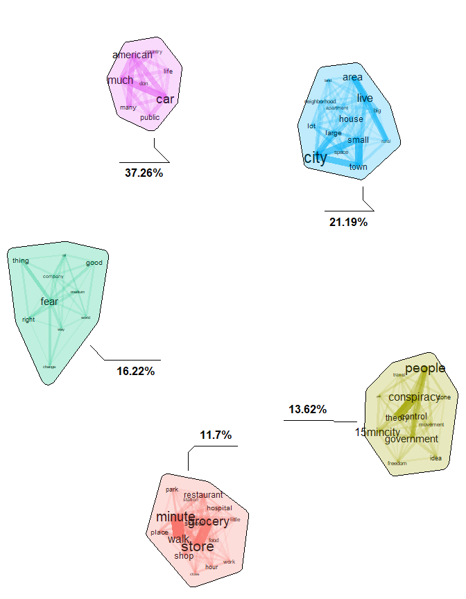

Biterm Topic Model (BTM)
================

### 1. Import libraries and dataset

#### Import libraries

``` r
library(tidyverse)
library(readxl)
library(tm)
library(BTM)
library(udpipe)
library(quanteda)
library(igraph)
library(ggraph)
library(tidyr)
library(broom)
library(textplot)
library(ggraph)
library(concaveman)
library(textstem)
library(data.table)
```

#### Import Dataset

``` r
data <- read_xlsx("Reddit_15mincity_Treated_Pass1.xlsx")
```

#### Filter eligible comments from the database

``` r
df <- data.frame(data) |>
  filter(Filter == 1) |>   #filter by the comments that were classified as relevant
  select(comment)
```

#### Rearrange the document to format required for the udpipe

``` r
df_tm <- mutate(df, doc_id =row_number())

colnames(df_tm) <- c("text", "doc_id")

df_tm <- df_tm |> 
  relocate(doc_id, text)
```

### 2. Data preprocessing

#### Standard data cleaning

``` r
# Remove punctuation
df_tm$text <- gsub(pattern = "\\W", replace = " ", df_tm$text)
# Take out urls
df_tm$text <- str_replace_all(df_tm$text, "(http\\S+)", "")
# Lowercase words
df_tm$text <- tolower(df_tm$text)
# remove single words 
df_tm$text <- gsub(pattern = "\\b[A-z]\\b{1}", replace = " ", df_tm$text) 
# Lematize terms in its dictionary form
df_tm$text <- lemmatize_strings(df_tm$text, dictionary = lexicon::hash_lemmas)
#Remove whitespace
df_tm$text <- stripWhitespace(df_tm$text)
```

#### remove stopwords

``` r
adicional_stopwords <- c("don, wasn", stopwords("en"))
df_tm$text <- removeWords(df_tm$text, adicional_stopwords)
```

#### Normalize all the terms of the 15-minute city to “15mincity”

``` r
df_tm$text <- str_replace_all(df_tm$text, "15 minute city", "15mincity")
df_tm$text <- str_replace_all(df_tm$text, "15 minute city", "15mincity")
df_tm$text <- str_replace_all(df_tm$text, "15-minute city", "15mincity")
df_tm$text <- str_replace_all(df_tm$text, "15-minute city", "15mincity")
df_tm$text <- str_replace_all(df_tm$text, "15-minute cities", "15mincity")
df_tm$text <- str_replace_all(df_tm$text, "15 min city", "15mincity")
df_tm$text <- str_replace_all(df_tm$text, "15 min cities", "15mincity")
```

#### Create biterms

``` r
biterm_data_tm <- udpipe(df_tm, "english", trace = 500)
```

    ## 2024-11-04 15:50:11.592336 Annotating text fragment 1/2347
    ## 2024-11-04 15:50:26.77391 Annotating text fragment 501/2347
    ## 2024-11-04 15:50:37.962437 Annotating text fragment 1001/2347
    ## 2024-11-04 15:50:51.240571 Annotating text fragment 1501/2347
    ## 2024-11-04 15:51:03.395242 Annotating text fragment 2001/2347

``` r
biterms <- as.data.table(biterm_data_tm)
biterms <- biterms[, cooccurrence(x = lemma,
                                  relevant = upos %in% c("NOUN",
                                                         "ADJ",
                                                         "PROPN") & 
                                    !lemma %in% stopwords("en"),
                                  skipgram = 5),
                   by = list(doc_id)]
```

### 3. Build BTM

#### Train the model

``` r
set.seed(588)
traindata <- subset(biterm_data_tm, upos %in% c("NOUN", "ADJ", "PROPN"))
traindata <- traindata[, c("doc_id", "lemma")]
model <- BTM(traindata, k = 5, 
             beta = 0.01, 
             iter = 1000,
             window = 15,
             biterms = biterms, 
             trace = 100)
```

    ## 2024-11-04 15:51:43 Start Gibbs sampling iteration 1/1000
    ## 2024-11-04 15:51:46 Start Gibbs sampling iteration 101/1000
    ## 2024-11-04 15:51:49 Start Gibbs sampling iteration 201/1000
    ## 2024-11-04 15:51:53 Start Gibbs sampling iteration 301/1000
    ## 2024-11-04 15:51:56 Start Gibbs sampling iteration 401/1000
    ## 2024-11-04 15:51:59 Start Gibbs sampling iteration 501/1000
    ## 2024-11-04 15:52:02 Start Gibbs sampling iteration 601/1000
    ## 2024-11-04 15:52:06 Start Gibbs sampling iteration 701/1000
    ## 2024-11-04 15:52:10 Start Gibbs sampling iteration 801/1000
    ## 2024-11-04 15:52:13 Start Gibbs sampling iteration 901/1000

#### Inspect the model - topic frequency + conditional term probabilities

``` r
model$theta
```

    ## [1] 0.1362396 0.1170003 0.3726281 0.1622498 0.2118821

``` r
topicterms <- terms(model, top_n = 25)
topicterms <- data.frame(topicterms)
```

#### plot topicterms

``` r
knitr::opts_chunk$set(fig.height = 9, fig.width = 7)
plot(model, top_n = 20, title ="",
     labels = paste(round(model$theta *
                            100, 2), "%", sep = ""))
```

<!-- -->

``` r
plot(model, top_n = 25, title ="",
     labels = c("Freedom of movement (10.22 %)", "Urban transition (21.41 %)", "Choice and opportunity (38.29 %)", "Explanation (13.43 %)", "Apprehension and misinformation (16.65 %)"))
```

<!-- -->

``` r
model$theta
```

    ## [1] 0.1362396 0.1170003 0.3726281 0.1622498 0.2118821
