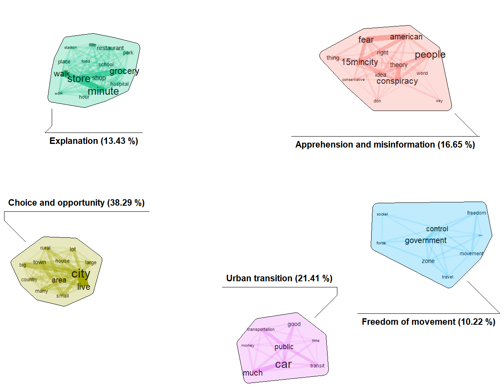
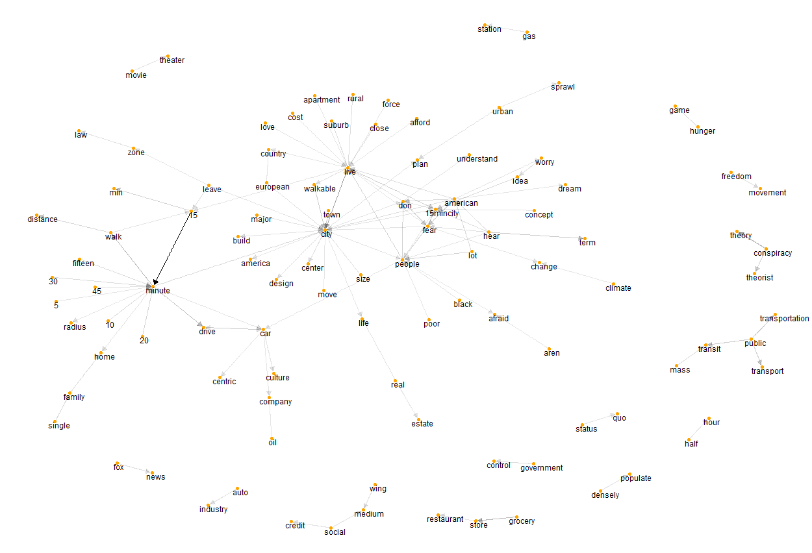

```{r setup, include=FALSE}
knitr::opts_chunk$set(echo = TRUE)
```

## Content 

This page was created for providing the code, reproducing the results and presenting the step-by-step process of the results found in the paper: 

> Valença, G.; Hook, H (2024). _Why do some American fear "15-minute cities"?_. Paper currently submitted for revision. 

**Short abstract**

_Using a textual social media dataset obtained from Reddit, this research analyses the public discussion on 16 and 17 February 2024 surrounding the question, ‘Why do some Americans fear “15-minute cities”?’, with a mixed-methods approach. Topic modelling was used to categorize 2,346 eligible responses to the question into five main topics: Choice and opportunity (38.29%), urban transition (21.41%), apprehension and misinformation (16.65%), explanation (13.43%), and freedom of movement (10.22%). Bigrams and a qualitative thematic analysis were used to validate these topics, identifying nuanced public perceptions about the 15-minute city, including lifestyle preferences, socioeconomic factors, car-centric urban planning, practical challenges, government control conspiracies, cultural resistance, conceptualization, feasibility, polarization, and social concerns._

**1. Code**

* Webscrapping the comments using Reddit's API: [code](WebScrapping.R)

* Bigrams and Biterm Topic Model (BTM): [code](TopicModelling_Bigram.R)

**2. Dataset**

The dataset used in this work is **shared only by request**. There are privacy risks related to sharing Reddit data. Nonetheless, researchers propose that sharing the dataset upon request is a respectable compromise, balancing the need for reproducibility with ethical considerations. Please contact the authors for the treated dataset with omitted id's.

**3. Results** 

* The BTM was used to identify patterns in the text. 

  
  
  

* The bigram network graph were used to identify the most common sequence of word pairs, providing context to the topics.  




